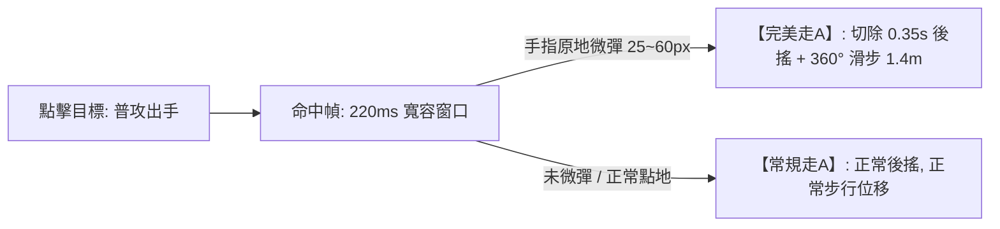

# 專案名稱：《VOW 誓約》全域遊戲設計白皮書 (The Gold Master GDD v3.0)

> **版本**：v3.0.0 (Gold Master Architecture)  
> **專案代號**：VOW 誓約 (vow3d)  
> **定位**：跨平台硬核競技 MOBA（iOS / Android / PC Steam）  
> **核心標籤**：點擊微操、微位移走A、地貌重塑、拓撲圍棋、零數值付費、電競級平衡  
> **架構驗證**：已通過兩輪極限事前剖析 (Premortem v1.0 & v2.0) 壓力測試，徹底消除反人類操作、數值滾雪球與工程性能死穴。

---

## 壹、 核心願景與設計哲學 (Vision & Pillars)

### 1. 致敬並超越《Vainglory (虛榮)》
* **拒絕廉價平庸**：徹底拋棄市面手遊「無腦推虛擬搖桿、自動鎖敵、無腦站樁輸出」的簡化套路，回歸移動端最高精度的電競純點擊觸控靈魂。
* **破除靜態棋盤**：打破傳統 MOBA 20 年來死板的「3 路固定推塔」，將戰場進化為**可局部塑形、三層立體高低差、板塊拓撲博弈**的活體大陸。

### 2. 三大黃金設計支柱
1. **身位大於數值 (Positioning over Stats)**：走A 的本質是「微調身位躲招與拉扯」，絕不作為數值膨脹（攻速/暴擊）的外掛溫床。
2. **預判大於全自動 (Prediction over Automation)**：施法權 100% 還給玩家，拒絕系統強制鎖死身後的智障輔助。
3. **動態對等而非單向虐殺 (Dynamic Equilibrium)**：近戰與遠程爭奪的是幾何身位空間，而非無解的單向數值碾壓。

---

## 貳、 核心微操系統：微位移節奏走A (Cadence Micro-Repositioning)



### 1. 操作流暢度與判定規範
* **普攻與位移判定**：
  - **點擊敵人**：英雄走入攻擊範圍，普攻出手。
  - **命中瞬間（220ms ~ 250ms 寬容窗口）**：英雄腳底泛起柔和節奏光環。
  - **手指原地微彈（25px ~ 60px，約 3.5~8 毫米）**：
    - 英雄瞬間朝微彈方向進行 **1.4 米 360° 微位移（Micro-Dash）**，留下青色殘影。
    - **立即切除 0.35 秒的普攻後搖**，角色身位即時重新定位。
* **120ms 預輸入緩衝（Input Buffering）**：
  - 在攻擊命中前 120ms 內預先滑動，指令自動進入緩衝並於命中幀精確釋放，徹底解決觸控「吃指令」問題。
* **智慧吸附（Smart Flick Magnet for Mobile）**：
  - 手機端微彈滑動角度自動微吸附至 8 個主要戰術方向（正交與對角線），使肉指在大拇指小幅度滑動時達到 100% 幾何精準度。

### 2. 徹底移除卡刀硬直（Zero Negative Punishment）
* **狂點螢幕不卡刀、不硬直**：
  - 玩家被追殺下意識狂點螢幕時，角色**絕對不會停步罰站**。
  - 未觸發微彈時，角色維持正常普攻與正常步行走位（Normal 平A 保底）。
  - 高手比新手的優勢在於：高手在每一槍之間能無縫滑步 1.4 米調整射角並躲避非指向技能，新手則需要原地吃滿 0.35 秒後搖。

### 3. 動畫幀時長與數值守恆（防外掛與防巨集）
* **走A 獎勵「嚴禁」增加攻擊速度與暴擊率**：
  - 攻擊速度嚴格由英雄屬性與裝備決定，確保動畫幀週期穩定，徹底消除電競手機「壓感肩鍵自動巨集連發」的作弊空間。
  - 搭配 iOS **CoreHaptics** 線性馬達：每次完美滑步給予微小、乾脆的「機械段落感震動（Click-haptic）」，打擊感極度紮實。

---

## 參、 技能與地貌塑形：雙態智慧地脈符印 (Rune Vector Casting)

```mermaid
graph TD
    A[右手拇指碰觸地脈符印] -->|長按拖曳 Hold & Drag| B[手動精確預判: 地面 3D 虛影跟隨拇指旋轉, 自由封路]
    A -->|雙擊 / 輕點 Quick-Cast| C[極速自保: 正前方 4 米快速升起橫向掩體石牆]
    B -->|滑向按鈕中心或上方| D[安全取消施法 (Cancel Zone)]
    B -->|鬆手 Release| E[石牆破土成形, 持續 5.0 秒]
```

### 1. 雙態施法操作
1. **長按拖曳 (Hold & Drag) —— 100% 自由預判封路**：
   - 拇指按住符印向外推動，地面以施法落點為軸心即時顯示 **3D 半透明石牆虛影**。
   - 拇指角度決定石牆阻隔方向，**拇指完全留在右下角盲操，絕不遮擋戰場中央核心視野**！
2. **雙擊 / 輕點 (Quick-Cast) —— 0.05 秒緊急防禦**：
   - 遭敵方近戰貼臉突進時，快速雙擊符印，直接在角色正前方 4 米生成一道垂直阻截石牆，化解追殺。
3. **取消保護 (Cancel Zone)**：
   - 滑回按鈕中心或上方取消區即可安全收招。

### 2. 防自閉與防堆疊物理規則 (Anti-Bunker Rules)
* **全隊石牆上限 2 面**：全隊場上最多同時存在 2 面石牆，立第 3 面時最早的石牆自動坍塌為碎石，杜絕地圖封死迷宮。
* **友軍彈道穿透且「不疊加增傷」**：
  - 友軍子彈與普攻穿透己方石牆（避免隊友互相拆台），但穿過多面石牆傷害不重複疊加。
  - 石牆具有 **6 次穿透耐久度**，承受 6 發友軍穿透攻擊後自然風化，防止「三牆狙擊碉堡流」。
* **近戰砸碎反制**：近戰重擊可一擊打碎石牆，碎石向後飛濺造成小額減速，成為近戰破陣手段。

---

## 肆、 戰鬥動態平衡：幾何對等 (Combat Dynamic Parity)

### 1. 近戰 vs 遠程動態守恆
* **位移數值動態平衡**：
  - **遠程滑步**：1.4 米（小巧、靈活、可向 360° 任意方向，用於躲避直線非指向技能）。
  - **近戰撲擊**：1.8 米（逼近威脅適中，給予近戰壓迫感，但不至於瞬間抹殺射手拉扯空間）。
* **內建冷卻防濫用 (Internal Cooldown on Buffs)**：
  - **遠程風步**：遠程滑步獲得 0.8 秒 +15% 衰減加速，**內建冷卻 3.5 秒**（無法無縫無限常駐風箏）。
  - **近戰重擊**：近戰飛撲命中附帶 1 秒 20% 減速，**消耗能量槽 30 點（滿值 100 點）**，考驗資源管理。
* **核心博弈**：雙方爭奪的是「0.4 米的身位差」與「走位躲避技能」，勝負取決於非指向技能命中率，而非無腦站擼或無腦風箏。

### 2. 四大基石元素化學反應
* **岩 (Solid) / 水 (Liquid) / 風 (Kinetic) / 火 (Thermal)**
* 統一固定 **1.5 倍** 元素交互：
  - **水 + 火 = 蒸氣迷霧**：遮蔽 4 米範圍敵方視野，進入者普攻落空率 +30%。
  - **水 + 岩 = 泥濘流沙**：降低區域內所有單位移速 35%，打斷衝刺。
  - **風 + 火 = 擴散火浪**：將火焰燃燒範圍呈扇形向前推進 6 米。

---

## 伍、 立體戰場：三層地貌與宏觀拓撲 (Vertical Topography)

### 1. 混合動態地貌架構（兼顧戰術深度與手遊 120 FPS）
* **常態三層結構**：
  - **高層【風蝕峭壁】**：俯射視野廣，射程 +10%。
  - **中層【地脈平原】**：主要推線與陣地戰場。
  - **低層【深淵暗河】**：刺客伏擊通道、常駐淺水（水元素增幅）。
* **預烘焙動態機關節點（NavMesh 穩定零崩潰）**：
  - **2 處【懸空岩橋】**：承受 4 次重擊後斷裂，中斷高地直通路徑。
  - **2 處【地熱升騰點】**：踩踏 0.6 秒後垂直彈跳翻越高台（高風險高回報突襲）。
  - **4 處【固有斜坡與階梯】**：確保全圖基礎尋路 100% 暢通，英雄野怪絕不卡模穿模。

### 2. 鏡頭智能網點透視 (Dithered Occlusion Transparency)
* 當固定 52° 俯視鏡頭被懸崖峭壁遮擋時，遮蔽岩體自動轉換為 **網點半透明 (Dithered Alpha)**。
* 低窪處英雄自帶發光輪廓外框（Outline Shader），360 度無死角透視。

---

## 陸、 宏觀戰略：地脈圍棋領地制 (Tectonic Dominance)

```mermaid
graph TD
    A[戰場 19 塊六邊形板塊] --> B[佔領共振晶塔產生領地積分 (目標 1000 分)]
    A --> C[包圍孤立敵方板塊 ➔ 觸發失聯中立化 (圍棋包夾)]
    D[第 10 分鐘: 深淵先鋒甦醒] --> E[正面團戰爭奪先鋒 ➔ 協助實體攻堅敵方晶塔]
    F[比賽時長: 嚴格收斂在 12~14 分鐘]
```

### 1. 19 塊六角形精簡棋盤拓撲
* 地圖精簡為極具辨識度的 **19 塊六邊形板塊**（中央 1 塊、中圈 6 塊、外圈 12 塊）。
* **佔領機制（實體交互）**：
  - 嚴禁小兵無腦佔地！
  - 英雄必須親自站在晶塔光圈內引導 3.5 秒（受到傷害立即打斷），鼓勵圍繞晶塔展開陣地交火。

### 2. 領地計分與圍棋包夾 (Encirclement Flip)
* **領地積分制（TDP，目標 1000 分）**：
  - 佔領板塊越多，每秒跳分越快。
  - 率先達到 1000 分或 15 分鐘倒計時結束時積分最高者獲勝。
* **圍棋切斷機制（Encirclement Severing）**：
  - 若一方成功佔領相鄰板塊，將敵方某塊邊緣板塊「完全切斷與其基地的連通（形成孤島）」：
  - 該孤島板塊進入【失聯斷能狀態】，立即停止產分，並在 20 秒後洗回中立狀態！
  - 戰略重心演變為**「斷敵後路、包夾孤立」**的真正圍棋博弈！

### 3. 第 10 分鐘：深淵先鋒（Abyssal Vanguard）
* **拒絕一偷定輸贏的搶龍機制**：
  - 擊殺深淵先鋒**不直接翻轉板塊**！
  - 先鋒召喚為強大的實體攻堅巨獸，協助擊殺方直接衝擊敵方晶塔。
  - 劣勢方可利用先鋒推進時，反向包抄優勢方後排，勝負依然回歸正面團戰實力。

---

## 柒、 平台生態與硬體對等 (Platform Parity)

### 1. 不切分匹配池的跨端平衡技術
* **全平台同池匹配（Unified Queue）**：維護健康的匹配速度（保證 30 秒內開局），拒絕鬼服。
* **PC 滑鼠輸入標準化（Rate Limiter）**：
  - PC 滑鼠微甩走A 設置內部冷卻與採樣速率限制，防止滑鼠巨集腳本（Macro）超頻作弊。
* **手機端專屬電競手感**：
  - 原生支援 **120Hz 刷新率**。
  - 呼叫 **CoreHaptics 線性馬達**，提供類似機械鍵盤青軸的俐落段落反饋。

---

## 捌、 敏捷工程落地路徑 (Engineering Roadmap)

```
[Phase 1: 核心微操驗證 (Greybox Prototype)]
  ├─ 點地移動與點目標攻擊 (Pure Tap)
  ├─ 220ms 寬容窗口 + 120ms 預輸入緩衝微位移走A
  └─ CoreHaptics 震動與切除後搖打擊感

[Phase 2: 雙態地脈符印與近遠平衡]
  ├─ 符印長按拖曳 3D 虛影旋轉指示器
  ├─ 符印雙擊 0.05s 極速前置石牆
  └─ 遠程 1.4m 滑步 vs 近戰 1.8m 飛撲數值調校

[Phase 3: 立體地貌與 19 塊圍棋戰場]
  ├─ 3 層高低差地圖與 6 處預設機關節點 (吊橋/噴泉)
  ├─ 19 塊六邊形板塊 BFS 連通性與包夾孤立演算法
  └─ 領地跳分系統 (1000分勝負) 與深淵先鋒

[Phase 4: 跨平台網絡同步與發行]
  ├─ 樂觀預測 (Client-Side Prediction) 抗延遲 Netcode
  ├─ PC Steam 鍵鼠與手機觸控對等調校
  └─ Shader 美化與性能壓測 (iOS/Android 穩 120 FPS)
```

---

> **簽署備忘**：  
> 本白皮書凝聚了從 v1.0 的反人類陷阱到 v2.0 的數值過度補償、再到 v3.0 的成熟工業化平衡的全部推演成果。  
> 這是一份可直接交給資深主企劃、資深主程式、Claude Code 或 Codex 的權威施工圖紙。
