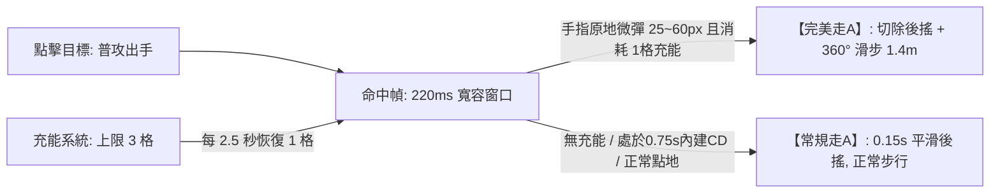

# 專案名稱：《VOW 誓約》全域遊戲設計白皮書 (Production Architecture v3.2)

> **版本**：v3.2.0 (Hardened Production Architecture)  
> **專案代號**：VOW 誓約 (vow3d)  
> **定位**：跨平台硬核競技 MOBA（iOS / Android / PC Steam）  
> **核心標籤**：點擊微操、充能微位移、地貌重塑、拓撲圍棋、四大基石元素、零數值付費  
> **工程驗證**：已完成獨立總監評審（9.2 分）與三輪極限 Premortem（v1.0 生理極限、v2.0 數值過補償、v3.1 高階漏洞壓測），並寫入「四大防禦性數值圍欄 (Production Guardrails)」，全面杜絕病態 Meta。

---

## 壹、 核心願景與設計哲學 (Vision & Pillars)

### 1. 致敬並超越《Vainglory (虛榮)》
* **拒絕廉價平庸**：徹底拋棄市面手遊「無腦推虛擬搖桿、自動鎖敵、無腦站樁輸出」的簡化套路，回歸移動端最高精度的電競純點擊觸控靈魂。
* **破除靜態棋盤**：打破傳統 MOBA 20 年來死板的「3 路固定推塔」，將戰場進化為**可局部塑形、三層立體高低差、板塊拓撲博弈**的活體大陸。

### 2. 三大黃金設計支柱
1. **身位大於數值 (Positioning over Stats)**：走A 的本質是「關鍵身位調整與拉扯」，絕不作為數值膨脹（攻速/暴擊）的外掛溫床。
2. **戰術爆發而非抽筋復健 (Tactical Burst over Finger Fatigue)**：走A 引入充能點數，將微位移昇華為「決策資源」，而非每槍逼死手指的無謂消耗。
3. **動態對等而非單向虐殺 (Dynamic Equilibrium)**：近遠破牆機制對等、圍棋包夾具備主場防禦紅利，拒絕無解的坐牢局。

---

## 貳、 核心微操系統：充能微位移走A (Charge-Based Cadence)



### 1. 徹底解救手指肌肉疲勞：【微操充能系統 (Flick Charges)】
* **上限 3 格微操充能**：
  - 英雄生命條下方顯示 3 顆發光的「微操充能點（Cadence Pips）」。
  - **自然恢復**：每 2.5 秒自動恢復 1 格充能。
  - **戰術決策**：平時以輕鬆節奏進行常規平A；在關鍵時刻（躲技能、拉扯、突進）打出精準的靈動微衝刺！手指負擔直接降低 70%。

### 2. 🛡️【防禦性圍欄一：防 4.2 米光速瞬移濫用 (Anti-Burst-Kite Guardrail)】
* **`0.75s 內建滑步冷卻 (Internal Cooldown)`**：
  - 連續消耗充能滑步時，強制加入 **0.75 秒的滑步間隔冷卻**。
  - 嚴格杜絕射手在 0.6 秒內光速連滑 3 次（4.2 米瞬間瞬移）導致刺客戰士摸不到人的極端漏洞，將連續微操拉長至健康的 2 秒博弈窗口。
* **真空期平滑補償 (Smooth Transition)**：
  - 充能為 0 時，普攻後搖設定為平滑的 **0.15 秒**（而非僵硬的 0.35 秒），避免玩家產生斷崖式的手感撕裂感。

### 3. 操作流暢度與判定規範
* **普攻與位移判定**：命中瞬間享有 **220ms ~ 250ms 寬容窗口**；手指在 25px ~ 60px 範圍內滑彈觸發。
* **120ms 預輸入緩衝（Input Buffering）**：命中前 120ms 內預先滑動自動存入緩衝，命中幀精準釋放，絕不吃指令。
* **智慧吸附（Smart Flick Magnet for Mobile）**：滑動角度自動吸附至 8 個主要戰術方向，使大拇指小幅度微彈具備 100% 幾何精準度。
* **狂點螢幕不卡刀、不硬直**：狂點時平穩切換至 Normal 平A，絕不原地發呆罰站。
* **動畫幀守恆**：走A 嚴禁增加攻速與暴擊，攻速嚴格由裝備決定，杜絕外掛肩鍵自動連發；搭配 iOS **CoreHaptics** 線性馬達提供乾脆段落反饋。

---

## 參、 技能與地貌塑形：雙態地脈符印與對等破牆 (Rune Vector Casting)

```mermaid
graph TD
    A[右手拇指碰觸地脈符印] -->|長按拖曳 Hold & Drag| B[手動精確預判: 地面 3D 虛影跟隨拇指旋轉, 自由封路]
    A -->|雙擊 / 輕點 Quick-Cast| C[極速自保: 正前方 4 米快速升起橫向掩體石牆]
    B -->|滑向按鈕中心或上方| D[安全取消施法 (Cancel Zone)]
    B -->|鬆手 Release| E[石牆破土成形, 持續 5.0 秒]
```

### 1. 雙態施法操作
1. **長按拖曳 (Hold & Drag) —— 100% 自由預判封路**：
   - 拇指按住符印向外推動，地面即時顯示 **3D 半透明石牆虛影**，拇指角度決定石牆朝向，盲操絕不遮擋中央視野！
2. **雙擊 / 輕點 (Quick-Cast) —— 0.05 秒緊急防禦**：
   - 遭敵方突進時，快速雙擊符印，直接在正前方 4 米生成垂直阻截石牆化解追殺。
3. **取消保護 (Cancel Zone)**：滑回按鈕中心或上方取消區安全收招。

### 2. 🛡️【防禦性圍欄二：防刷血包與防坑隊友 (Anti-Shield Battery & Friendly Bunker Guardrails)】
* **陣營歸屬校驗 (Faction-Based Check)**：
  - 近戰英雄普攻砸碎石牆獲得 **150 點岩石護盾（持續 2.5s）** 的特權，**嚴格限制僅能作用於「敵方石牆」或「中立石牆」**！
  - 擊碎己方石牆不觸發護盾，徹底杜絕近戰自產自銷把石牆當「瞬發免費血包」濫用的漏洞。
* **友軍穿透掩體碉堡 (Friendly Penetration without Penalty)**：
  - 友軍遠程彈道穿透己方石牆時，**不扣減傷害、不消耗耐久**（賦予全隊單面牆 10 發子彈穿透上限）。
  - 將己方石牆定位為真正的「戰術射擊掩體」，徹底消除隊友築牆反而害射手降低 DPS 的衝突負反饋。
* **全隊石牆上限 2 面**：場上最多同時存在 2 面石牆，立第 3 面時最早的石牆自動坍塌為碎石。

---

## 肆、 戰鬥動態平衡與四大基石元素 (Elements & Dynamics)

### 1. 近戰 vs 遠程動態守恆
* **位移數值動態平衡**：
  - **遠程滑步**：1.4 米（小巧、靈活、可向 360° 任意方向，用於躲避直線非指向技能）。
  - **近戰撲擊**：1.8 米（逼近威脅適中，給予近戰壓迫感，但不至於瞬間抹殺射手拉扯空間）。
* **內建冷卻限制**：
  - **遠程風步**：遠程滑步獲得 0.8 秒 +15% 衰減加速，**內建冷卻 3.5 秒**（無法無縫無限常駐風箏）。
  - **近戰重擊**：近戰飛撲命中附帶 1 秒 20% 減速，**消耗能量槽 30 點（滿值 100 點）**。

### 2. 🛡️【防禦性圍欄三：四大基石元素硬核收斂 (Elemental Balance Guardrails)】
四大基石元素：【岩 (Solid)、水 (Liquid)、風 (Kinetic)、火 (Thermal)】。  
將元素反應嚴格收斂在地貌狀態，並寫入數值防禦門檻：

1. **水 + 岩 = 泥濘流沙 (Quicksand)**：
   - 潮濕地表被岩石技能擊中，化為半徑 4 米泥濘沼澤，持續 3.5 秒。
   - **`防禦數值`**：**禁位移（縛足）時間嚴格壓縮為 1.2 秒**（非 3.5 秒毀滅性死刑！），後續剩餘時間僅保留 35% 減速，給予對手走位交解控的生存空間。
2. **水 + 火 = 蒸氣迷霧 (Steam Fog)**：
   - 地面產生半徑 4 米厚重蒸氣，持續 3.0 秒，遮斷視野。
   - **`防偷點機制`**：迷霧加入 **受擊顯影 (Damage Revelation，受到傷害立即顯形 1.5 秒)**；且在**蒸氣迷霧內引導晶塔速度減半 (佔點懲罰)**，徹底杜絕無交互「霧中偷點流」。
3. **風 + 火 = 擴散火浪 (Firestorm Shockwave)**：
   - 朝火焰地表釋放風系衝擊，將烈焰呈 60° 扇形向前推進 6 米，造成 1.5 倍直接傷害。

---

## 伍、 立體戰場：三層地貌與宏觀拓撲 (Vertical Topography)

### 1. 混合動態地貌架構（兼顧戰術深度與手遊 120 FPS）
* **常態三層結構**：
  - **高層【風蝕峭壁】**：俯射視野廣，射程 +10%。
  - **中層【地脈平原】**：主要推線與陣地戰場。
  - **低層【深淵暗河】**：刺客伏擊通道、常駐淺水（水元素增幅）。
* **預烘焙動態機關節點（NavMesh 穩定零崩潰）**：
  - **2 處【懸空岩橋】**：承受 4 次重擊後斷裂，中斷高地直通路徑。
  - **2 處【地熱升騰點】**：踩踏 0.6 秒後垂直彈跳翻越高台（高風險高回報突襲）。
  - **4 處【固有斜坡與階梯】**：確保全圖基礎尋路 100% 暢通，英雄野怪絕不卡模穿模。

### 2. 鏡頭智能網點透視 (Dithered Occlusion Transparency)
* 當固定 52° 俯視鏡頭被懸崖峭壁遮擋時，遮蔽岩體自動轉換為 **網點半透明 (Dithered Alpha)**。
* 低窪處英雄自帶發光輪廓外框（Outline Shader），360 度無死角透視。

---

## 陸、 宏觀戰略：地脈圍棋與主場防守紅利 (Tectonic Sanctuary)

```mermaid
graph TD
    A[戰場 19 塊六邊形板塊] --> B[佔領共振晶塔產生領地積分: 目標 1000 分]
    A --> C[包圍孤立敵方板塊 ➔ 觸發失聯中立化 (圍棋包夾)]
    C -->|孤立斷能且比分落後 >15%| D[觸發【斷能反衝】: 守方獲 12秒 基地狂怒增益, 絕地反擊!]
    E[基地周邊 3 塊【母板塊】] --> F[【地脈聖所】: 守方獲 15% 減傷, 遭圍城超 2 分鐘線性遞減]
    G[第 10 分鐘: 深淵先鋒甦醒] --> H[正面團戰爭奪實體攻堅巨獸, 拒絕偷龍抽籤]
    I[比賽時長: 嚴格收斂在 12~14 分鐘]
```

### 1. 19 塊六角形精簡棋盤拓撲
* 地圖精簡為極具辨識度的 **19 塊六邊形板塊**（中央 1 塊、中圈 6 塊、外圈 12 塊）。
* **佔領機制（實體交互）**：英雄必須親自站在晶塔光圈內引導 3.5 秒（受傷打斷），鼓勵陣地正面交火。

### 2. 🛡️【防禦性圍欄四：防戰術獻祭與防極限烏龜流 (Anti-Sacrifice & Anti-Turtle Guardrails)】
* **斷能反衝「劣勢判定鎖 (Deficit Verification Lock)」**：
  - 外圍板塊被包夾斷能瞬間觸發 12 秒【絕地狂怒（移速+15%，技能加速25%）】的條件，**嚴格綁定「當前比分落後超過 15%」**！
  - 均勢或優勢方被斷能**不觸發狂怒**，徹底封死高端隊伍在開大龍前「故意賣板塊騙取狂怒 Buff 團滅對手」的戰術獻祭漏洞。
* **母板塊地脈聖所「圍城衰減機制 (Siege Decay)」**：
  - 基地 3 塊母板塊常態提供 **+15% 減傷與 +20% 韌性**，奪回晶塔引導縮短為 1.8 秒。
  - **`圍城衰減`**：若敵方控制全圖 70% 板塊超過 **2 分鐘**，母板塊的 15% 減傷每秒遞減直至為 0，逼迫防守方必須出門拼死一戰，杜絕極致縮頭烏龜流將遊戲拖入無聊的 15 分鐘計分局。

### 3. 第 10 分鐘：深淵先鋒（Abyssal Vanguard）
* 擊殺深淵先鋒**不直接翻轉板塊**！先鋒化為實體攻堅巨獸協助推進，勝負回歸正面團戰實力。
* 率先達到 1000 分或 15 分鐘倒計時結束時積分最高者勝，單局耗時鎖定在 **12 ~ 14 分鐘**。

---

## 柒、 平台生態與硬體對等 (Platform Parity)

### 1. 不切分匹配池的跨端平衡技術
* **全平台同池匹配（Unified Queue）**：維護健康的匹配速度（保證 30 秒內開局），拒絕鬼服。
* **PC 滑鼠輸入標準化（Rate Limiter）**：PC 滑鼠微甩走A 設置內部冷卻與採樣速率限制，防止滑鼠巨集腳本超頻作弊。
* **手機端專屬電競手感**：原生支援 **120Hz 刷新率**；呼叫 **CoreHaptics 線性馬達** 提供俐落段落反饋。

---

## 捌、 敏捷工程落地路徑 (Engineering Roadmap)

```
[Phase 1: 核心微操與圍欄驗證 (Greybox Prototype)]
  ├─ 點地移動與點目標攻擊 (Pure Tap)
  ├─ 3格充能 + 0.75s 內建CD + 0.15s 平滑後搖
  └─ CoreHaptics 震動反饋與 1.4m 微衝刺身法

[Phase 2: 雙態符印、破牆校驗與四大元素]
  ├─ 符印長按拖曳 3D 虛影旋轉指示器
  ├─ 符印雙擊 0.05s 極速前置石牆
  ├─ 陣營校驗破牆 (砸敵牆得護盾) vs 友軍穿透掩體 (10發上限無衰減)
  └─ 四大元素收斂地貌 (泥濘流沙 1.2s 禁位移、蒸氣霧受擊顯影)

[Phase 3: 立體地貌與 19 塊圍棋戰場]
  ├─ 3 層高低差地圖與 6 處預設機關節點 (吊橋/噴泉)
  ├─ 19 塊六邊形板塊 BFS 連通性與包夾斷能反衝 (綁定15%劣勢鎖)
  ├─ 母板塊【地脈聖所】15% 減傷 (附帶 2 分鐘圍城衰減)
  └─ 領地跳分系統 (1000分勝負) 與深淵先鋒

[Phase 4: 跨平台網絡同步與發行]
  ├─ 樂觀預測 (Client-Side Prediction) 抗延遲 Netcode
  ├─ PC Steam 鍵鼠與手機觸控對等調校
  └─ Shader 美化與性能壓測 (iOS/Android 穩 120 FPS)
```

---

> **簽署備忘**：  
> 本白皮書 v3.2 已完成所有防禦性圍欄封堵，將頂級職業選手可能鑽研的所有機制漏洞（光速瞬移、無限刷盾、霧中偷點、戰術獻祭、極端烏龜）在代碼動工前全部扼殺。  
> 這是一份兼具電競藝術感與工程防禦強度的終極工業級藍圖。
