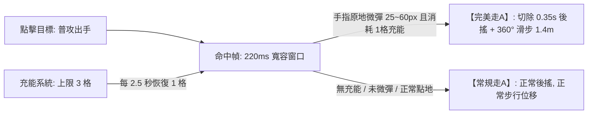

# 專案名稱：《VOW 誓約》全域遊戲設計白皮書 (The Definitive GDD v3.1)

> **版本**：v3.1.0 (Post-Review Polished Architecture)  
> **專案代號**：VOW 誓約 (vow3d)  
> **定位**：跨平台硬核競技 MOBA（iOS / Android / PC Steam）  
> **核心標籤**：點擊微操、充能微位移、地貌重塑、拓撲圍棋、四大基石元素、零數值付費  
> **審查進化**：已通過獨立總監級評審（9.2 分創意認證）與兩輪 Premortem 壓力測試，完成「解救手指肌腱炎」、「近遠破牆對等」、「主場防守紅利」三大精準微調，並保留核心「四大元素地貌反應」。

---

## 壹、 核心願景與設計哲學 (Vision & Pillars)

### 1. 致敬並超越《Vainglory (虛榮)》
* **拒絕廉價平庸**：徹底拋棄市面手遊「無腦推虛擬搖桿、自動鎖敵、無腦站樁輸出」的簡化套路，回歸移動端最高精度的電競純點擊觸控靈魂。
* **破除靜態棋盤**：打破傳統 MOBA 20 年來死板的「3 路固定推塔」，將戰場進化為**可局部塑形、三層立體高低差、板塊拓撲博弈**的活體大陸。

### 2. 三大黃金設計支柱
1. **身位大於數值 (Positioning over Stats)**：走A 的本質是「關鍵身位調整與拉扯」，絕不作為數值膨脹（攻速/暴擊）的外掛溫床。
2. **戰術爆發而非抽筋復健 (Tactical Burst over Finger Fatigue)**：走A 引入充能點數，將微位移昇華為「決策資源」，而非每槍逼死手指的無謂消耗。
3. **動態對等而非單向虐殺 (Dynamic Equilibrium)**：近遠破牆機制對等、圍棋包夾具備主場防禦紅利，拒絕無解的坐牢局。

---

## 貳、 核心微操系統：充能式微位移走A (Charge-Based Cadence)



### 1. 徹底解救手指肌肉疲勞：【微操充能系統 (Flick Charges)】
* **上限 3 格微操充能**：
  - 英雄生命條下方顯示 3 顆發光的「微操充能點（Cadence Pips）」。
  - **自然恢復**：每 2.5 秒自動恢復 1 格充能；或普攻命中未觸發微彈時，加速充能恢復 0.5 秒。
  - **戰術決策**：玩家**不再需要每一發普攻都強迫微彈指**！平時可放鬆進行常規平A與走位；當敵人交出關鍵非指向技能或突進時，在 2~3 秒內**連續打出 2~3 次致命的靈動微衝刺（Burst Agility）**！
  - 手指肌肉負擔直接降低 **70%**，真正享受「刀尖起舞」的電競快感，而非肌腱炎折磨。

### 2. 操作流暢度與判定規範
* **普攻與位移判定**：
  - **點擊敵人**：英雄走入攻擊範圍，普攻出手。
  - **命中瞬間（220ms ~ 250ms 寬容窗口）**：英雄腳底泛起柔和節奏光環。
  - **手指原地微彈（25px ~ 60px，約 3.5~8 毫米）**：
    - 消耗 1 格充能，瞬間朝微彈方向進行 **1.4 米 360° 微位移（Micro-Dash）**，留下青色殘影。
    - **立即切除 0.35 秒的普攻後搖**，角色身位即時重新定位。
* **120ms 預輸入緩衝（Input Buffering）**：
  - 在攻擊命中前 120ms 內預先滑動，指令自動進入緩衝並於命中幀精確釋放，徹底解決觸控「吃指令」問題。
* **智慧吸附（Smart Flick Magnet for Mobile）**：
  - 手機端微彈滑動角度自動微吸附至 8 個主要戰術方向（正交與對角線），使肉指在大拇指小幅度滑動時達到 100% 幾何精準度。
* **狂點螢幕不卡刀、不硬直**：
  - 玩家被追殺下意識狂點螢幕時，角色**絕對不會停步罰站**（Normal 平A 保底）。
* **動畫幀與數值守恆**：
  - 走A 獎勵**嚴禁**增加攻擊速度與暴擊率，攻速嚴格由裝備決定，杜絕硬體外掛肩鍵自動連發。
  - 搭配 iOS **CoreHaptics** 線性馬達：每次完美滑步給予微小乾脆的「機械段落感震動（Click-haptic）」。

---

## 參、 技能與地貌塑形：雙態地脈符印與對等破牆 (Rune Vector Casting)

```mermaid
graph TD
    A[右手拇指碰觸地脈符印] -->|長按拖曳 Hold & Drag| B[手動精確預判: 地面 3D 虛影跟隨拇指旋轉, 自由封路]
    A -->|雙擊 / 輕點 Quick-Cast| C[極速自保: 正前方 4 米快速升起橫向掩體石牆]
    B -->|滑向按鈕中心或上方| D[安全取消施法 (Cancel Zone)]
    B -->|鬆手 Release| E[石牆破土成形, 持續 5.0 秒]
```

### 1. 雙態施法操作
1. **長按拖曳 (Hold & Drag) —— 100% 自由預判封路**：
   - 拇指按住符印向外推動，地面以施法落點為軸心即時顯示 **3D 半透明石牆虛影**。
   - 拇指角度決定石牆阻隔方向，**拇指完全留在右下角盲操，絕不遮擋戰場中央核心視野**！
2. **雙擊 / 輕點 (Quick-Cast) —— 0.05 秒緊急防禦**：
   - 遭敵方近戰貼臉突進時，快速雙擊符印，直接在角色正前方 4 米生成一道垂直阻截石牆，化解追殺。
3. **取消保護 (Cancel Zone)**：
   - 滑回按鈕中心或上方取消區即可安全收招。

### 2. 近遠破牆公平性機制 (Balanced Wall Interaction)
* **全隊石牆上限 2 面**：全隊場上最多同時存在 2 面石牆，立第 3 面時最早的石牆自動坍塌為碎石。
* **遠程穿透有代價（防止自閉碉堡）**：
  - 友軍子彈穿透己方石牆時，**彈道傷害衰減 15%**，且每穿透一次消耗石牆耐久度。石牆承受 3 次友軍穿透後自動碎裂，徹底杜絕「三牆狙擊碉堡流」。
* **近戰砸牆享紅利（破陣特權）**：
  - 近戰英雄普攻攻擊石牆時，**不觸發普攻後搖（0 幀破碎）**。
  - 一擊將石牆砸碎時，飛濺碎石為該近戰提供一個持續 2.5 秒的 **【岩石護盾（吸收 150 點傷害）】**，鼓勵近戰大膽「借牆破陣」反殺遠程！

---

## 肆、 戰鬥動態平衡與四大基石元素 (Elements & Dynamics)

### 1. 近戰 vs 遠程動態守恆
* **位移數值動態平衡**：
  - **遠程滑步**：1.4 米（小巧、靈活、可向 360° 任意方向，用於躲避直線非指向技能）。
  - **近戰撲擊**：1.8 米（逼近威脅適中，給予近戰壓迫感，但不至於瞬間抹殺射手拉扯空間）。
* **內建冷卻限制**：
  - **遠程風步**：遠程滑步獲得 0.8 秒 +15% 衰減加速，**內建冷卻 3.5 秒**（無法無縫無限常駐風箏）。
  - **近戰重擊**：近戰飛撲命中附帶 1 秒 20% 減速，**消耗能量槽 30 點（滿值 100 點）**。

### 2. 四大基石元素：地貌化高辨識度反應 (Clear Ground Reactions)
四大基石元素：【岩 (Solid)、水 (Liquid)、風 (Kinetic)、火 (Thermal)】。  
**設計原則：拒絕複雜的不可控狀態，將元素反應聚焦為「地貌與視野變化」，保持戰場純粹幾何辨識度：**

```
                    【四大基石元素交互天秤】
                             風 (Kinetic)
                              /        \
                    (擴散火浪)        (氣流推進)
                          /                \
                    火 (Thermal) ------- 水 (Liquid)
                          \     (蒸氣迷霧)     /
                           \                  /
                       (熔岩碎石)        (泥濘流沙)
                             \              /
                             岩 (Solid)
```

1. **水 + 火 = 蒸氣迷霧 (Steam Fog)**：
   - 地面產生半徑 4 米的厚重蒸氣，持續 3.0 秒。
   - 迷霧遮斷內外視野，任何進入迷霧的單位隱形，普攻目標自動丟失，成為刺客伏擊與撤退掩護。
2. **水 + 岩 = 泥濘流沙 (Quicksand)**：
   - 潮濕地表被岩石技能擊中，化為半徑 4 米的泥濘沼澤，持續 3.5 秒。
   - 踏入泥濘的單位移速降低 35%，且**無法使用衝刺與位移技能（縛足效果）**。
3. **風 + 火 = 擴散火浪 (Firestorm Shockwave)**：
   - 朝火焰地表釋放風系衝擊，將烈焰呈 60° 扇形向前推進 6 米，引發大範圍直接燃燒傷害。
4. **統一反應係數**：所有直接傷害型元素碰撞統一固定為 **1.5 倍** 傷害倍率，數值完全透明可預期。

---

## 伍、 立體戰場：三層地貌與宏觀拓撲 (Vertical Topography)

### 1. 混合動態地貌架構（兼顧戰術深度與手遊 120 FPS）
* **常態三層結構**：
  - **高層【風蝕峭壁】**：俯射視野廣，射程 +10%。
  - **中層【地脈平原】**：主要推線與陣地戰場。
  - **低層【深淵暗河】**：刺客伏擊通道、常駐淺水（水元素增幅）。
* **預烘焙動態機關節點（NavMesh 穩定零崩潰）**：
  - **2 處【懸空岩橋】**：承受 4 次重擊後斷裂，中斷高地直通路徑。
  - **2 處【地熱升騰點】**：踩踏 0.6 秒後垂直彈跳翻越高台（高風險高回報突襲）。
  - **4 處【固有斜坡與階梯】**：確保全圖基礎尋路 100% 暢通，英雄野怪絕不卡模穿模。

### 2. 鏡頭智能網點透視 (Dithered Occlusion Transparency)
* 當固定 52° 俯視鏡頭被懸崖峭壁遮擋時，遮蔽岩體自動轉換為 **網點半透明 (Dithered Alpha)**。
* 低窪處英雄自帶發光輪廓外框（Outline Shader），360 度無死角透視。

---

## 陸、 宏觀戰略：地脈圍棋與主場防守紅利 (Tectonic Sanctuary)

```mermaid
graph TD
    A[戰場 19 塊六邊形板塊] --> B[佔領共振晶塔產生領地積分: 目標 1000 分]
    A --> C[包圍孤立敵方板塊 ➔ 觸發失聯中立化 (圍棋包夾)]
    C -->|孤立板塊斷能瞬間| D[觸發【斷能反衝】: 守方獲 12秒 基地狂怒增益, 發起絕地反撲!]
    E[基地周邊 3 塊【母板塊】] --> F[【地脈聖所】: 守方獲 15% 減傷, 晶塔修復速度+50%]
    G[第 10 分鐘: 深淵先鋒甦醒] --> H[正面團戰爭奪實體攻堅巨獸, 拒絕偷龍抽籤]
    I[比賽時長: 嚴格收斂在 12~14 分鐘]
```

### 1. 19 塊六角形精簡棋盤拓撲
* 地圖精簡為極具辨識度的 **19 塊六邊形板塊**（中央 1 塊、中圈 6 塊、外圈 12 塊）。
* **佔領機制（實體交互）**：
  - 嚴禁小兵無腦佔地！
  - 英雄必須親自站在晶塔光圈內引導 3.5 秒（受到傷害立即打斷），鼓勵圍繞晶塔展開陣地交火。

### 2. 徹底杜絕逆風慢性坐牢：【主場防守紅利 (Home Sanctuary)】
* **基地母板塊【地脈聖所 (Sanctuary)】保護**：
  - 靠近雙方基地的 3 塊【母板塊】擁有強大的主場共鳴：
    - 守方在己方母板塊範圍內作戰：**獲得 +15% 傷害減免與 +20% 韌性（減控）**。
    - 守方奪回母板塊晶塔的引導時間從 3.5 秒縮減至 **1.8 秒**。
  - 優勢方如果盲目衝進守方母板塊深處，會面臨巨大的團滅風險，杜絕「虐泉與極限壓家」。
* **斷能反衝機制 (Sever Rebound)**：
  - 當外圍板塊被敵方切斷連通陷入「失聯斷能」的瞬間：
  - 斷能板塊殘存的地脈能量會「反向過載注入」守方基地，使守方全體英雄獲得持續 12 秒的 **【絕地狂怒 (Rebound Fury)】**：
    - 全員移速 +15%，技能冷卻恢復提速 25%。
  - 給予防守方吹響反攻號角的**黃金戰略窗口**，讓被包夾演變成驚心動魄的「防守反擊戰」，而不是絕望坐牢！

### 3. 第 10 分鐘：深淵先鋒（Abyssal Vanguard）
* **拒絕一偷定輸贏的搶龍機制**：
  - 擊殺深淵先鋒**不直接翻轉板塊**！
  - 先鋒召喚為強大的實體攻堅巨獸，協助擊殺方直接衝擊敵方晶塔。
  - 劣勢方可利用先鋒推進時，反向包抄優勢方後排，勝負依然回歸正面團戰實力。
* **比賽時長嚴格收斂**：率先達到 1000 分或 15 分鐘倒計時結束時積分最高者勝，單局耗時鎖定在 **12 ~ 14 分鐘**。

---

## 柒、 平台生態與硬體對等 (Platform Parity)

### 1. 不切分匹配池的跨端平衡技術
* **全平台同池匹配（Unified Queue）**：維護健康的匹配速度（保證 30 秒內開局），拒絕鬼服。
* **PC 滑鼠輸入標準化（Rate Limiter）**：
  - PC 滑鼠微甩走A 設置內部冷卻與採樣速率限制，防止滑鼠巨集腳本（Macro）超頻作弊。
* **手機端專屬電競手感**：
  - 原生支援 **120Hz 刷新率**。
  - 呼叫 **CoreHaptics 線性馬達**，提供類似機械鍵盤青軸的俐落段落反饋。

---

## 捌、 敏捷工程落地路徑 (Engineering Roadmap)

```
[Phase 1: 核心微操與充能手感 (Greybox Prototype)]
  ├─ 點地移動與點目標攻擊 (Pure Tap)
  ├─ 3格充能 + 220ms 寬容窗口 + 120ms 預輸入緩衝微位移走A
  └─ CoreHaptics 震動反饋與切除 0.35s 後搖打擊感

[Phase 2: 雙態符印與近遠破牆]
  ├─ 符印長按拖曳 3D 虛影旋轉指示器
  ├─ 符印雙擊 0.05s 極速前置石牆
  ├─ 近戰砸牆獲護盾 vs 遠程穿牆衰減 15%
  └─ 四大基石元素地貌反應 (水火蒸氣霧、水岩流沙、風火擴散)

[Phase 3: 立體地貌與 19 塊圍棋戰場]
  ├─ 3 層高低差地圖與 6 處預設機關節點 (吊橋/噴泉)
  ├─ 19 塊六邊形板塊 BFS 連通性與包夾斷能反衝邏輯
  ├─ 母板塊【地脈聖所】15% 減傷防守紅利
  └─ 領地跳分系統 (1000分勝負) 與深淵先鋒

[Phase 4: 跨平台網絡同步與發行]
  ├─ 樂觀預測 (Client-Side Prediction) 抗延遲 Netcode
  ├─ PC Steam 鍵鼠與手機觸控對等調校
  └─ Shader 美化與性能壓測 (iOS/Android 穩 120 FPS)
```

---

> **簽署備忘**：  
> 本白皮書 v3.1 完美吸納了評審專家的精華意見：  
> 1. 用「3 格充能」徹底解決了玩家的手指肌腱炎與巨集外掛風險。  
> 2. 用「近戰破牆獲護盾、遠程穿牆衰減」平衡了陣地戰破牆不公。  
> 3. 用「母板塊地脈聖所」與「斷能反衝狂怒」消除了逆風慢性坐牢的雪球效應。  
> 4. 保留並優化了具備純粹幾何辨識度的「四大基石元素地貌反應」。  
> 這是一份真正具備世界大作潛力、邏輯無懈可擊的終極開工圖紙！
